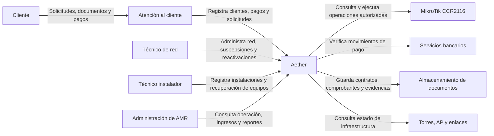

# Diagrama de contexto de Aether

## Propósito

Este diagrama muestra a Aether como un sistema completo y las personas
y sistemas externos con los que interactúa.

```mermaid
flowchart LR
    customerService["Atención al cliente"]
    networkTechnician["Técnico de red"]
    installer["Técnico instalador"]
    administration["Administración de AMR"]

    customer["Cliente"]
    aether["Aether"]

    mikrotik["MikroTik CCR2116"]
    bank["Servicios bancarios"]
    documentStorage["Almacenamiento de documentos"]
    networkInfrastructure["Torres, AP y enlaces"]

    customer -->|"Solicitudes, documentos y pagos"| customerService

    customerService -->|"Registra clientes, pagos y solicitudes"| aether
    networkTechnician -->|"Administra red, suspensiones y reactivaciones"| aether
    installer -->|"Registra instalaciones y recuperación de equipos"| aether
    administration -->|"Consulta operación, ingresos y reportes"| aether

    aether -->|"Consulta y ejecuta operaciones autorizadas"| mikrotik
    aether -->|"Verifica movimientos de pago"| bank
    aether -->|"Guarda contratos, comprobantes y evidencias"| documentStorage
    aether -->|"Consulta estado de infraestructura"| networkInfrastructure
```