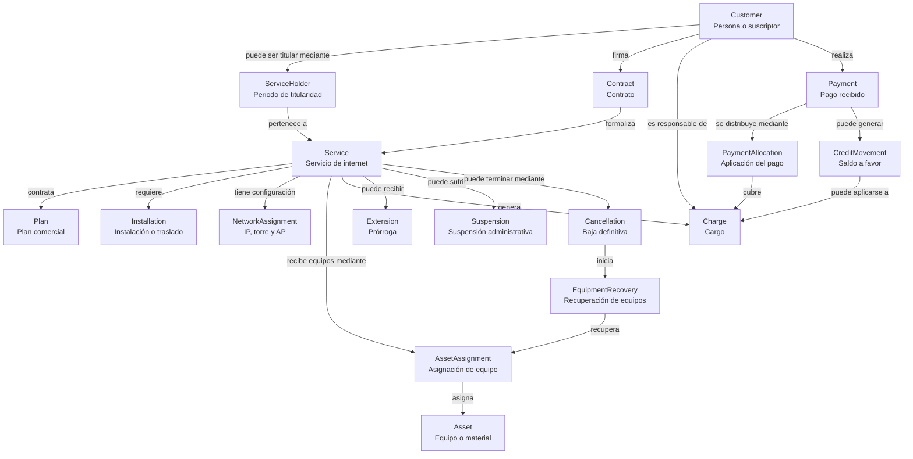

# Modelo de dominio de Aether

## Propósito

Este diagrama representa los conceptos principales de Servicios AMR
y las relaciones existentes entre ellos.

No representa todavía tablas de PostgreSQL ni clases de Python.

