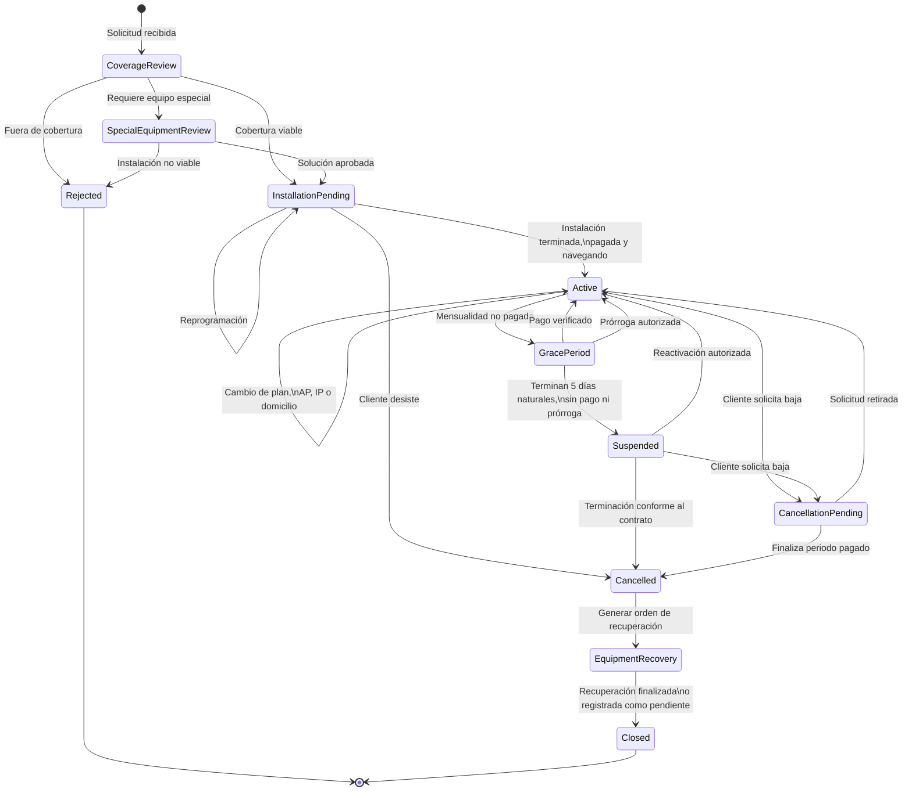

# Ciclo de vida del servicio

## Propósito

Este diagrama representa los estados comerciales de un servicio de
internet y las condiciones que permiten pasar de un estado a otro.

Las interrupciones técnicas de red no aparecen como suspensión,
porque no modifican el estado comercial del servicio.

