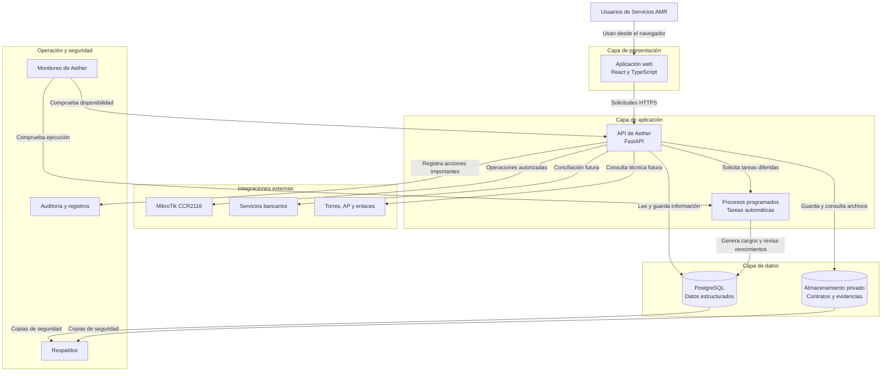

# Arquitectura técnica de Aether

## Propósito

Este diagrama muestra los principales componentes técnicos previstos
para Aether y la forma general en que se comunicarán.

No representa todavía servidores definitivos, puertos, protocolos
detallados ni decisiones de despliegue cerradas.

